# Custom Emoji 1.1

A collection of icons that I'm using in Slack. All have already been resized to be within Slack's max image size, and most scale down to text size pretty well. 

Base icon set sourced from [w33ble](https://github.com/w33ble)'s [Adium Hipchat Emoticon set](https://github.com/w33ble/adium-hipchat-emoticons)

v1.1 Icons sourced from a variety of places, but notably the collection by [snipe](https://github.com/snipe)'s [awesome-emoji](https://github.com/snipe/awesome-emoji) set provided quite a few

### Easy installation

Use this chrome extension to add all these neat custom emojis in seconds: [Slack Emoji Tools](https://chrome.google.com/webstore/detail/slack-emoji-tools/anchoacphlfbdomdlomnbbfhcmcdmjej)

### Icons

| Icon | File Name |
| --------------------------------------------- | --------------------------------------- |
| | 1password.png |
| | 50cent.png |
|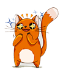 | Bandit_excited.png |
| | Bandit_grumpy.png |
| | Bandit_heart.png |
| | Bandit_hmph.png |
|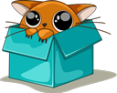 | Bandit_in_a_box.png |
|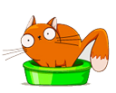 | Bandit_litterbox.png |
|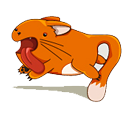 | Bandit_running.png |
| | Bandit_smooch.png |
| | Bandit_tangled.png |
| | Bandit_tired.png |
| | Bandit_wet.png |
| | GitKraken.png |
| | Kirk.png |
| | aactocat.png |
| | adventuretime.gif |
| | alert.gif |
| | alive.png |
| | allo-crying.gif |
| | allo-kissing.gif |
| | allo-love.gif |
| | allo-unamused.gif |
|              | allthethings.png |
|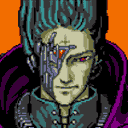 | allyourbase.gif |
|                        | android.png |
| | areyoukiddingme.png |
|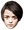 | arya.png |
| | asanacheck.png |
| | aussieparrot.gif |
| | avocado.png |
| | awesome.png |
| | aws.png |
| | awthanks.png |
| | awww.png |
| | awyeah.png |
| | babygoat.gif |
| | bacon.png |
| | back.gif |
|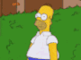 | back_away.gif |
| | backtowork.gif |
|  | badgerbadgerbadger.gif |
| | badjokeeel.png |
| | badpokerface.png |
| | bagel.png |
| | bandit.gif |
| | barf.png |
|                          | batman.gif |
| | bb8.gif |
|                          | bender.png |
|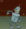 | bender-alt.gif |
| | bender-banana.gif |
| | bhangra.gif |
| | bigeyes.png |
| | blazeit420.png |
| | bluebottle.png |
| | bobross.png |
| | boo.png |
| | boom-alt.gif |
|                            | booom.gif |
| | boredparrot.gif |
|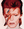 | bowie.jpg |
|                          | branch.png |
| | bronzemedal.png |
|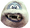 | bumble.png |
| | burger.gif |
|                    | candycorn.png |
| | catchemall.png |
|                  | ceilingcat.png |
| | celery.png |
| | cereal.png |
|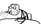 | cerealspit.png |
| | challengeaccepted.png |
|                            | chewy.png |
|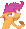 | chompier.gif |
| | chompy.gif |
| | chrazy.gif |
|                          | chrome.png |
|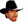 | chucknorris.png |
| | clap.gif |
| | clapping.gif |
|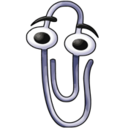 | clippy.png |
| | command.png |
| | confusedpuppy.gif |
| | construction.gif |
| | content.png |
| | cookie.png |
| | cookiemonster.png |
|                          | coolio.png |
| | corgi.png |
|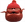 | cornelius.png |
| | cowbell.png |
|| cowbell-alt.png |
| | cowboy.gif |
|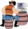 | cowboycoding.gif |
| | creeper.gif |
| | croissant.png |
| | cylon_animated.gif |
|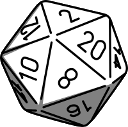 | d20.png |
|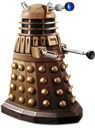 | dalek.png |
| | dancing-banana.gif |
| | dancing-banana-brian.gif |
| | dancingbart.gif |
| | dancingburrito.gif |
| | dancingburrito2.gif |
| | dancingcarlton.gif |
| | dancingcat.gif |
| | dancingchewbacca.gif |
| | dancingcow.gif |
| | dancingcupcake.gif |
| | dancingdonald.gif |
| | dancingfrog.gif |
| | dancinggluten.gif |
| | dancinghobbes.gif |
| | dancingminion.gif |
| | dancingorange.gif |
| | dancingpanda.gif |
| | dancingpizza.gif |
| | dancingpotato.gif |
| | dancingsonic.gif |
| | dancingspiderman.gif |
| | dancingtaco.gif |
| | dancingunicorn.gif |
| | darthvader |
| | dead.png |
| | dealwithit.gif |
| | dealwithitparrot.gif |
| | deathly_hallows.png |
| | dice.png |
| | dim_sum.png |
| | dobby.png |
| | docker.png |
| | doge.png |
| | doh.png |
| | donatello.png |
| | donkey.png |
| | donotwant.png |
| | dosequis.png |
| | drake.png |
|                      | dramatic.gif |
| | drevil.png |
| | drhorrible.png |
| | drone.gif |
|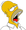 | drool.png |
| | dropbox.png |
| | drupal.png |
| | duck.png |
|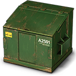 | dumpster.png |
| | dumpster_fire.gif |
| | easy.png |
| | eeyore.png |
| | emo.gif |
| | epic-sax-guy.gif |
| | evil.png |
| | evilburns.png |
| | excellent.png |
|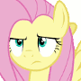 | eyeroll.gif |
| | facepalm.png |
| | failed.png |
| | fascinating.png |
| | fb-angry.gif |
| | fb-heart.gif |
| | fb-like.gif |
| | fb-laugh.gif |
| | fb-sad.gif |
| | fb-wow.gif |
| | fedora.png |
| | fingerscrossed.png |
|                        | firefox.png |
|    | firstworldproblem.png |
| | fixit.gif |
|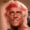 | flair.gif |
| | flappybird.gif |
| | flappybird-green.gif |
| | flappybird-orange.gif |
| | flappybird-purple.gif |
| | flappybird-teal.gif |
| | flyingmario.gif |
| | fonzie.png |
| | foreveralone.png |
| | fox.png |
| | freeskiyeti.png |
| | friedbrain.png |
| | fyeah.png |
|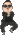 | gangnamstyle.gif |
| | git.png |
| | github.png |
| | githubunicorn.png |
| | goldmedal.png |
| | goodnews.png |
| | goomba.gif |
| | great.png |
|                    | grumpycat.png |
| | gulpjs.png |
|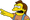 | haha.png |
| | hansolo.gif |
| | headdesk.gif |
| | highfive.gif |
|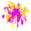 | holi.gif |
| | huemanatee.png |
| | hug.gif |
| | hugefan.png |
| | hummingbird.png |
| | hypnotoad.gif |
|                                  | ie.png |
| | imdb.png |
| | indeed.png |
| | inlove.gif |
| | iseewhatyoudidthere.png |
| | itsatrap.png |
| | itshappening.png |
| | jackie.png |
| | jagr.png |
|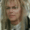 | jareth.gif |
| | jarjar.gif |
| | jira.png |
| | js.png |
| | kanye.png |
| | keepcalmsheepon.gif |
| | kirby.gif |
| | kirbychompy.gif |
| | koopa.png |
| | leftshark-alt.gif |
| | leftshark.png |
| | life-mushroom.jpg |
| | lilbub.png |
| | lincoln.png |
| | loading-pinwheel.gif |
| | loading-plz.gif |
| | lol.png |
|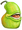 | lolwut.png |
| | loopconf.png |
| | lyft.png |
| | marching.gif |
|                            | mario.gif |
| | mario-coin.gif |
| | mario-question.gif |
|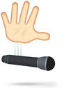 | micdrop.jpg |
| | milleniumfalcon.gif |
|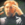 | mindblown.gif |
| | mls.png |
| | mockingjay.png |
|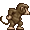 | monkey.gif |
|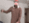 | monkeydance.gif |
|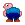 | mooning.gif |
| | moonwalk.gif |
| | moreyouknow.gif |
| | motherofgod.gif |
|                                | mrt.png |
| | mryuck.png |
|                      | mustache.png |
| | nes.png |
|                      | netscape.png |
| | newrelic.png |
| | ninja.jpg |
|                              | nope.png |
| | notbad.jpg |
| | nothingtodohere.png |
| | nothingtoseehere.gif |
| | notsureif.png |
|                        | nyancat.gif |
| | nyancat-alt.gif |
| | nyancat_big.gif |
|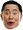 | ohmy.png |
| | ohyeahh.jpg |
| | okaycrying.png |
| | olaf.png |
| | olympics.png |
| | omg-panda.gif |
| | orly.png |
|                            | opera.png |
| | pancakes.png |
| | panda_dance.gif |
| | partycat.png |
| | partyparrot.gif |
| | patrick.png |
| | phpelephant.png |
| | phpstorm.png |
| | peace.png |
| | peace-alt.png |
| | penguin-dance.gif |
| | pepper.png |
|            | philosoraptor.png |
|                                | php.png |
|                      | pingpong.png |
| | pokerface.png |
| | pride.png |
| | puggoround.gif |
| | puglife.png |
| | r2confused.gif |
| | r2d2.gif |
| | rageguy.gif |
|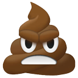 | ragepoop.png |
| | rainbowtv.gif |
|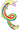 | rainicorn.png |
| | raspi.png |
| | rightshark.png |
| | riker.jpg |
|                          | reddit.png |
|              | robotunicorn.gif |
| | roger-roger.png |
| | rsl.png |
| | rubberduck.gif |
|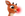 | rudolph.png |
| | sadbillmurray.png |
|                      | sadpanda.png |
|                          | safari.png |
| | salad.png |
| | salt.png |
|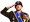 | salute.png |
| | samuel.png |
| | santa.png |
|| scoobydoo.gif |
| | scotch.jpg |
| | servermeltdown.gif |
| | shedoesntevengohere.jpg |
| | shakesfist.gif |
| | shiftyeyes.gif |
|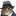 | shipit.png |
|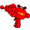 | shrinkray.png |
| | shuffleparrot.gif |
| | shutupandtakemymoney.jpg |
| | sillywalk.gif |
| | silvermedal.png |
| | simba.gif |
| | skywalker.gif |
| | sonic.gif |
| | spicey.png |
| | snoop.png |
|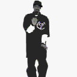 | snoop_dancing.gif |
| | stanleycup.png |
| | stapler.png |
| | starbucks.png |
| |success.png |
| | success-kid.png |
| | sweetjesus.png |
| | tardis.gif |
| | tardis.png |
| | taylorswift.gif |
| | teardrop.png |
| | theyregreat.png |
| | thisisfine.png |
|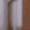 | thumbit.gif |
|                |timeforthat.gif |
| | trogdor.gif |
| | trogdor.png |
| | trump.png |
| | tumbleweed.gif |
| | twelfth-doctor.png |
| | tyrion.png |
| | upvote.png |
| | vagrant.png |
| | verified.png |
| | vote.png |
| | waiting.gif |
|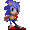 | waitsonic.gif |
| | waldo.png |
| | walkingcamel.gif |
| | walkinggodzilla.gif |
| |wapuu.png |
| | wat.png |
| | whatttt.png |
| | whoa.png |
| | whynotboth.gif |
| | woohoo.gif |
| |wordpress.png |
| | workout.gif |
|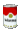 | worms.gif |
| |wpaz.png (Arizona WordPress Group) |
| | wtf.gif |
| | yey.png |
| | yoda.gif |
| | yodawg.gif |
| | yoga.gif |
| | yoshi.png |
| | youdontsay.png |
| | yougotitdude.gif |
| | zombie.gif |
